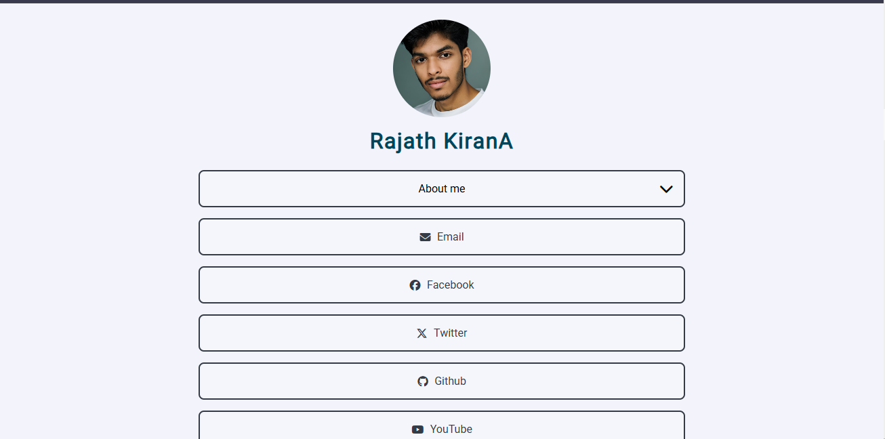
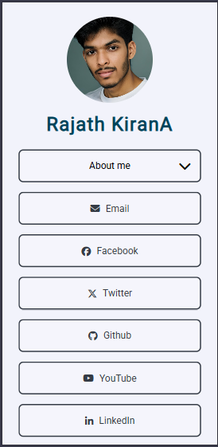

# 🎨 Personal Minimalist Portfolio

[](https://opensource.org/licenses/MIT)
[](https://developer.mozilla.org/en-US/docs/Web/HTML)
[](https://developer.mozilla.org/en-US/docs/Web/CSS)
[](https://developer.mozilla.org/en-US/docs/Web/JavaScript)
[](https://developer.mozilla.org/en-US/docs/Learn/CSS/CSS_layout/Responsive_Design)
[](https://pages.github.com/)

> A sleek, one-page personal portfolio website built with vanilla HTML, CSS, and JavaScript. Features a clean minimalist design with a focus on showcasing your professional profile and social media presence.

## 🚀 Live Demo

**👉 [View Live Portfolio](https://rajath2005.github.io/Raj_res.github.io/preview.html)**

## 📸 Screenshots

### Desktop View



### Mobile View



### Theme Variations

*Add your theme variations screenshot here*

## 📋 Table of Contents

- [✨ Features](#-features)
- [🔧 How It Works](#-how-it-works)
- [🛠️ Technologies Used](#️-technologies-used)
- [📦 Installation](#-installation)
- [🎯 Usage](#-usage)
- [🌟 Demo Features](#-demo-features)
- [🤝 Contributing](#-contributing)
- [📄 License](#-license)
- [👨‍💻 Author](#-author)

## ✨ Features

- **🎨 Minimalist Design** - Clean, professional, and distraction-free interface
- **📱 Fully Responsive** - Perfect display on all devices (desktop, tablet, mobile)
- **🌐 Social Media Integration** - Connect all your social profiles seamlessly
- **📄 Downloadable Resume** - One-click resume download functionality
- **🎭 Multiple Themes** - Choose from various color schemes and layouts
- **🖼️ Profile Picture Upload** - Personalize with your photo
- **⚡ Real-time Preview** - See changes instantly as you edit
- **🎨 Customizable Contact Cards** - Generate and download personalized contact cards
- **🚀 Fast Loading** - Optimized for performance and speed
- **💾 Easy to Deploy** - Simple deployment to GitHub Pages


## 🛠️ Technologies Used

| Technology | Purpose |
|------------|---------|
|  | Structure and semantic markup |
|  | Styling, animations, and responsive design |
|  | Interactive functionality and dynamic content |
|  | Hosting and deployment |


## 📄 License

This project is licensed under the **MIT License** - see the [LICENSE](LICENSE) file for details.

```
MIT License

Copyright (c) 2024 Your Name

Permission is hereby granted, free of charge, to any person obtaining a copy
of this software and associated documentation files (the "Software"), to deal
in the Software without restriction, including without limitation the rights
to use, copy, modify, merge, publish, distribute, sublicense, and/or sell
copies of the Software...
```

## 👨‍💻 Author

**Rajath kIran A**
- GitHub: [Rajath2005]([https://github.com/your-username](https://github.com/Rajath2005))
- LinkedIn: [Your LinkedIn]([https://linkedin.com/in/your-profile](https://www.linkedin.com/in/rajath-kiran/))
- Email: your.arajath5463@gmail.com

---


<div align="center">
  <p>⭐ Star this repository if you found it helpful!</p>
  <p>Made with ❤️ by <a href="https://github.com/your-username">Your Name</a></p>
</div>
